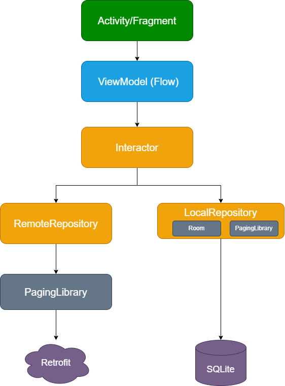

# Afisha

## About

The application provides users with the ability to view movies from a selected country, sorted by rating. The main goal of the application is to offer quick and convenient access to top-rated movies based on the chosen country. Users can browse movie descriptions, making it easy to find a suitable film for enjoyable leisure time.

## Screenshots

| Countries | Movies | Movie |
|------------|------------|------------|
|  |  |  |

## Features

### Build With

- **Hilt Dependency Injection:** Used for managing dependencies, enhancing code quality, maintainability, and scalability.
- **Paging Library:** Employed for paginated data loading, improving application performance, and enhancing user interaction and perception.
- **MVVM (Model-View-ViewModel):** Implemented for separating the UI layer from business logic, contributing to code quality and maintainability.
- **Room:** Utilized for working with the SQLite database, improving performance and security in database operations.
- **Coroutines:** Applied for writing asynchronous code, facilitating efficient handling of concurrent tasks.
- **Retrofit:** Employed for handling network requests asynchronously, with support for integration with Gson for JSON parsing.
- **Picasso:** Used for loading and displaying images in the application.
- **Cicerone:** Integrated for navigation between different screens in the application.
- **Lottie:** Implemented for creating animations, particularly utilized for the loading icon.

### Package Structure

```
afisha
  |
  ├── base
  |   |
  |   ├── data
  |   |   |
  |   |   └── Contains base classes and utilities for data layer.
  |   |
  |   └── ui
  |       |
  |       └── Contains base classes and utilities for the user interface.
  |
  ├── common
  |   |
  |   ├── cicerone
  |   |   |
  |   |   └── Manages navigation using Cicerone.
  |   |
  |   ├── database
  |   |   |
  |   |   └── Manages common database-related functionality.
  |   |
  |   ├── extension
  |   |   |
  |   |   └── Includes extension functions for Kotlin.
  |   |
  |   └── network
  |       |
  |       └── Manages network-related functionality.
  |
  ├── data
  |   |
  |   ├── local
  |   |   |
  |   |   ├── dao
  |   |   |   |
  |   |   |   └── Includes Data Access Objects for local data access.
  |   |   |
  |   |   ├── entity
  |   |   |   |
  |   |   |   └── Defines entities for local data storage.
  |   |   |
  |   |   └── mapper
  |   |       |
  |   |       └── Contains mappers to convert local entities.
  |   |
  |   └── remote
  |       |
  |       ├── api
  |       |   |
  |       |   └── Defines API interfaces for remote data access.
  |       |
  |       ├── entity
  |       |   |
  |       |   └── Defines entities for remote data.
  |       |
  |       └── paging
  |           |
  |           └── Manages paginated data loading.
  |
  ├── di
  |   |
  |   └── Manages dependency injection setup using Hilt.
  |
  ├── domain
  |   |
  |   ├── interactor
  |   |   |
  |   |   └── Implements interactors for business logic.
  |   |
  |   └── model
  |       |
  |       └── Defines data models for the domain.
  |
  └── ui
      |
      ├── country
      |   |
      |   └── Manages UI components for country selection.
      |
      ├── main
      |   |
      |   └── Contains main UI components and screens.
      |
      ├── movieDetail
      |   |
      |   └── Manages UI components for displaying movie details.
      |
      └── top
          |
          └── Manages UI components for displaying top-rated movies.
```

### Architecture

This app uses **MVVM (Model View View-Model)** architecture.

<div style="text-align: center">
 
</div>

## Running on Your Device

To run the application on your device, you need to add the API key from Kinopoisk to the <em>local.properties</em> file:
- apiKey = YOUR_API_KEY