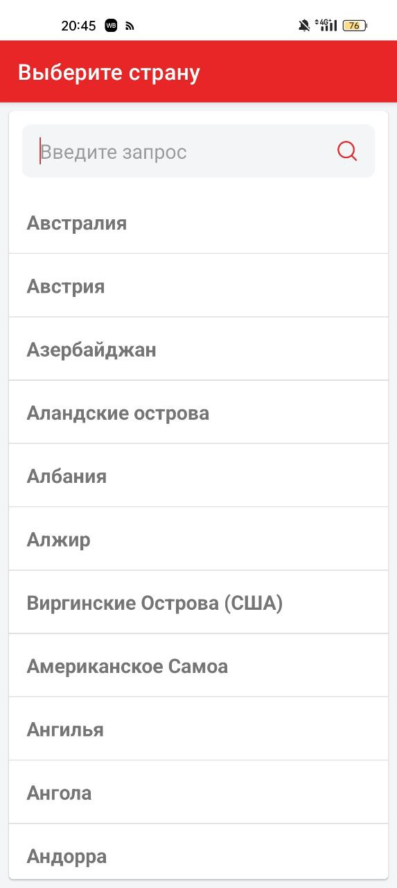
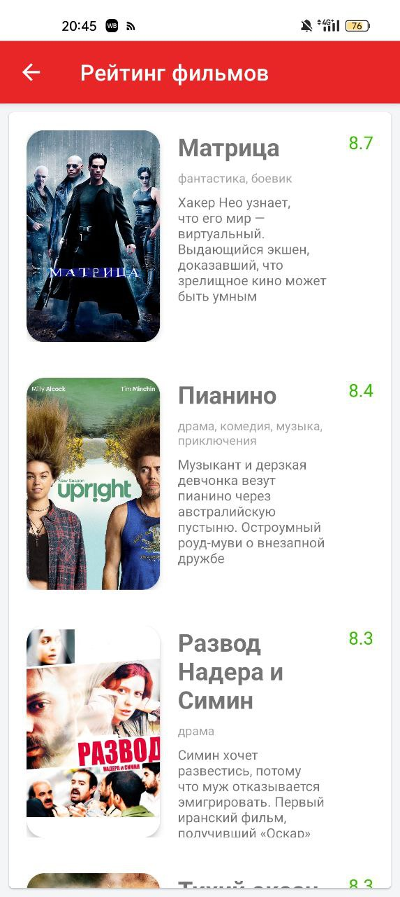
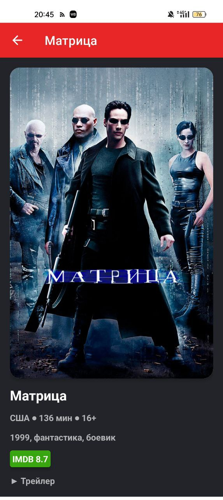

# 
Киноафиша

Приложение предоставляет пользователям возможность просмотра фильмов выбранной страны, отсортированных по рейтингу. Основная цель приложения заключается в предоставлении быстрого и удобного доступа к рейтинговым фильмам в зависимости от выбранной страны. Пользователи могут просматривать описания фильмов, что позволяет легко найти подходящий фильм для приятного времяпрепровождения.

## 
Скриншоты приложения

<em>Список стран</em>

  

<em>Список фильмов</em>

  

<em>Карточка фильма</em>

  

<em>Пустой экран</em>

  

## 
Используемые технологии

- <b>Hilt dependency injection</b> для управления зависимостями, что помогает улучшить качество, поддерживаемость и масштабируемость кода.
- <b>Paging Library</b> для загрузки данных постранично, что помогает улучшить производительность приложения и общее взаимодействие и восприятия пользователя с продуктом.
- <b>MVVM</b> для разделения UI слоя от бизнес логики, что помогает улучшить качество кода и поддерживаемость.
- <b>Room</b> для работы с базой данных SQLite, что помогает улучшить производительность и безопасность при работе с ними.
- <b>Coroutines</b> для написания асинхронного кода.
- <b>Retrofit</b> для работы с сетевыми запросами. Позволяет работать асинхронно с запросами, поддерживает интеграцию с <b>Gson</b>
- <b>Picasso</b> для загрузки и отображения изображений.
- <b>Cicerone</b> для навигации между экранами.
- <b>Lottie</b> для реализации анимаций. Используется для реализации иконки загрузки.

## 
Запуск на вашем устройстве

Для запуска приложения на вашем устройстве необходимо в файл <em>local.properties</em> добавить API ключ от [кинопоиска](https://api.kinopoisk.dev/v1/documentation):
- apiKey = ВАШ_API_КЛЮЧ
